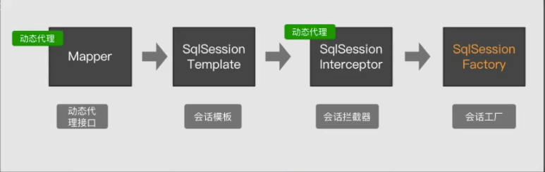

MyBatis Spring Adapter
======================

MyBatis-Spring adapter is an easy-to-use Spring bridge for MyBatis sql mapping framework.

Supported Versions
------------------

- 1.3.x - Continued support for Java 6 and 7
- master (2.0.x) - Support for Java 8, Spring 5, and Junit 5 plus other java 8 requirements

Essentials
----------

* [See the published docs](http://mybatis.github.io/spring/)
* [See the snapshot docs](src/site/markdown) (Note: may contain explanation of unreleased features)

# Spring集成Mybatis
那么Spring集成Mybatis的时候，为什么一级缓存会失效？其实不能说是失效了，只能说是没用上。
原因：Spring和Mybatis集成的时候，如果没有配置事务的情况下，它每次都会去构造一个新的会话（即所用的BaseExecutor也会不一样，不是同一个对象）。
 
那Spring的源码是如何集成Mybatis的呢？步骤大概为
Mapper（动态代理）——>SqlSessionTemplate——>SqlSessionInterceptor（动态代理）——>SqlSessionFactory(Mybatis)
如下图所示：

源码里SqlSessionProxy对应的其实就是SqlSessionInterceptor
